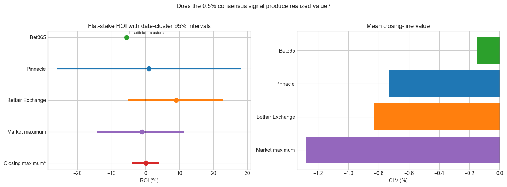

# Football Over/Under Market Efficiency Research

A reproducible quantitative research project testing whether simple team
scoring-form variables contain incremental probability information after
conditioning on no-vig bookmaker consensus odds in European over/under
2.5-goal markets.

The project is framed as a research prototype, not as betting advice or a
production trading system. Its main value is the disciplined research workflow:
leakage-aware feature engineering, chronological model validation, expected
value based bet selection, source-specific settlement, and honest reporting of
negative and fragile results.

## Research motivation

Bookmaker odds are a strong probability benchmark. A realistic betting model
must therefore do more than predict match outcomes: it must estimate
probabilities well enough to identify prices where expected value is positive
after market margin and execution constraints.

This repository investigates four questions:

1. After conditioning on no-vig market probability, do recent team
   scoring-form variables add stable incremental information?
2. Does pooling multiple leagues into one regularized model improve stability
   compared with fitting separate league-level models?
3. When the model estimates positive expected value, do selected bets generate
   credible out-of-sample ROI and closing-line value?
4. Can a model-free market-consensus probability support stable fractional
   Kelly staking across named execution venues?

## Data

The repository uses Football-Data.co.uk CSV files covering:

- Leagues: Bundesliga, La Liga, Premier League, and Serie A
- Seasons: 2021/22 through 2025/26
- Market: over/under 2.5 goals
- Fields used: match date, teams, full-time goals, market average and maximum
  odds, named bookmaker odds, and closing odds

Raw files are stored under `data/raw/` and are loaded without manual editing.
Field definitions and source-column interpretations are documented in
[`data/data_dictionary.md`](data/data_dictionary.md).

The source CSV files are not distributed with this repository and are excluded
from Git. Before running the notebooks, download the relevant league-season
files directly from
[Football-Data.co.uk](https://www.football-data.co.uk/downloadm.php) and place
them in `data/raw/`. Files must follow the naming convention documented in
[`data/README.md`](data/README.md), for example
`Premier_League_24_25.csv`.

## Methodology

### Target

The binary target is:

```text
1 if total full-time goals > 2.5, else 0
```

### Features

For each match, the model uses information available before the fixture:

- no-vig market log-odds from average pre-closing over/under prices;
- home season-to-date average goals scored;
- away season-to-date average goals scored;
- home average goals scored over the previous five matches;
- away average goals scored over the previous five matches.

Team-form features are shifted by one match, so the current match result cannot
enter its own predictors. Feature histories restart within each league-season.

### Market-anchored probability model

The core model is an L2-regularized logistic regression implemented in
`src/football_edge/model.py`. It is a **market-anchored probability model**,
not a fundamentals-only football model: no-vig consensus market log-odds form
the primary anchor, while team-form variables estimate conditional adjustments
to that anchor. Predictors are standardized using training data only, and model
convergence is checked.

The research evolved through two model designs:

1. **League-specific market-anchored baseline**: separate walk-forward models
   are trained for each league. This is useful as a benchmark, but it has small-sample and
   coefficient-stability issues.
2. **Pooled market-anchored model**: one unified model is trained across all
   leagues using exactly the previous two seasons before each test season. League
   indicators allow different league baselines while sharing market and form
   slopes. This is the main modeling direction.

Notebook 02 compares ridge penalties of 1, 10, and 100. Notebook 01 presents
the selected pooled specification with `L2 = 100`.

### Walk-forward validation

The project avoids random splits. Models are evaluated chronologically:

- train only on seasons before the test season;
- assert that the latest training date is earlier than the first test date;
- standardize features using training data only;
- evaluate all model variants on comparable out-of-sample periods.

For the selected pooled model, each test season is predicted using only the
previous two seasons across all available leagues.

## Betting logic

The strategy is expressed in expected-value terms:

```text
EV = model_probability * decimal_odds - 1
```

Here, `model_probability` is a market-adjusted estimate. The economic test asks
whether its conditional adjustments identify execution prices that are
mispriced relative to the market anchor; it does not compare an independent
fundamentals forecast with unrelated bookmaker prices.

A flat one-unit over-2.5 bet is selected only when:

```text
EV >= 3%
```

The same model probability is evaluated against multiple execution-price
scenarios:

- Bet365
- Pinnacle
- Betfair Exchange
- Market average
- Market maximum
- Closing market maximum sensitivity (`MaxC>2.5`, used only as an optimistic
  diagnostic because it is not a pre-closing executable quote)

ROI is calculated as total betting profit divided by total staked units. It is
not a portfolio return on starting capital. The main pooled-model study uses
flat stakes. Notebook 05 separately tests prespecified fractional Kelly rules
using a model-free market-consensus probability; this is a bankroll-risk
experiment, not evidence independent of the underlying probability signal.
The project does not implement volatility targeting or portfolio optimization
across simultaneous betting venues.

## Evaluation

The repository reports both predictive and economic diagnostics:

- Brier score
- log loss
- accuracy
- calibration intercept and slope
- coefficient stability
- expected-value bucket diagnostics
- number of bets
- hit rate
- average odds
- realized ROI
- approximate ROI confidence intervals
- cumulative profit / drawdown style diagnostics
- closing-line value where a later closing quote exists
- monthly ROI and monthly selected-bet counts

The EV-bucket notebook groups all candidate bets into fixed, prespecified
buckets:

```text
<0%, 0-2%, 2-4%, 4-6%, 6-10%, >=10%
```

This is intended to diagnose whether higher estimated EV is associated with
better realized performance, without choosing a new threshold after seeing the
backtest.

## Key findings

The main empirical result is cautious:

- The market-implied probability is the dominant forecasting signal and is
  very hard to beat.
- The simple scoring-form variables do not demonstrate stable incremental value
  after conditioning on the market anchor.
- The first league-specific approach is unstable and does not show a reliable
  edge.
- Pooling leagues and using stronger L2 regularization improves coefficient
  stability and calibration relative to weaker regularization settings.
- The selected pooled model (`L2 = 100`, previous two seasons, all leagues)
  is more statistically stable than the initial league-specific baseline.
- However, the tested specification still does not establish a robust,
  production-ready betting edge. ROI and CLV vary materially across execution
  source, season, and league.

In short: the pooled model is a better research direction, but the current data
and feature set are not sufficient to claim persistent profitability.

## Representative result



The independent market-consensus experiment in notebook 05 illustrates the
project's central conclusion. Betfair Exchange has the strongest realized
point estimate, but its date-cluster confidence interval crosses zero and its
mean closing-line value is negative. Other executable sources are either
approximately flat, negative, or too sparse for reliable inference. The
closing-market maximum is shown only as a non-executable sensitivity.

## Limitations and points requiring caution

This section is deliberately explicit because these are exactly the issues a
professional quantitative reviewer should care about.

### Signal and execution-price dependence

The no-vig market logit is constructed from average pre-closing odds, and the
tested named-bookmaker or market-maximum prices may contribute to that same
consensus. This is not target leakage because match outcomes are not used, but
it means the probability signal and execution prices are not fully independent.
Without constituent quotes, a leave-one-bookmaker-out consensus cannot be
constructed. Results should therefore be interpreted as a market-relative
pricing overlay rather than evidence from a standalone fundamentals model.

### Quote timing and executability

The dataset distinguishes pre-closing and closing odds, but it does not provide
reliable exact timestamps for when each quote was available. The analysis
therefore cannot fully verify that every price used in the backtest was
simultaneously observable and executable at decision time.

Named bookmaker prices are more realistic execution proxies than market-average
or market-maximum prices, but the project still cannot model stake limits,
liquidity, rejected bets, account restrictions, or live market availability.

### Pinnacle 2025/26 data quality

Football-Data reports that Pinnacle odds became systematically unreliable after
23 July 2025 because of problems with its public API, and that Pinnacle was
subsequently excluded from market-average and market-maximum calculations.
Pinnacle results for 2025/26 and cross-season comparisons involving consensus
prices should therefore be interpreted cautiously. See the
[official Football-Data notice](https://www.football-data.co.uk/data).

### Market maximum and closing maximum

Market-maximum odds are an optimistic benchmark because the best available
bookmaker can differ from match to match. Closing market maximum (`MaxC>2.5`)
is even more restrictive: it is a closing-price sensitivity, not a genuine
pre-match execution assumption. It should be interpreted as a diagnostic upper
bound, not as evidence of executable profitability.

### Potential data leakage risk

Rolling goal features are shifted and walk-forward folds are chronological.
Those safeguards reduce target leakage. The main unresolved leakage risk is
odds timing: without quote timestamps, the repository cannot prove that every
odds field was available before the model decision point.

### Statistical uncertainty

Betting outcomes are noisy and can be dominated by a small number of matches.
Approximate confidence intervals are useful diagnostics but do not fully
account for clustering by league, season, matchday, or common model error.

### Researcher degrees of freedom

The 3% EV threshold is treated as prespecified, and the EV-bucket analysis is
used to avoid threshold hunting. Still, choices such as feature set, rolling
window length, model family, training window, and regularization grid are
research decisions. Further out-of-sample or live paper-trading validation is
needed.

### Feature scope

The model intentionally uses a compact feature set. It does not include goals
conceded, opponent strength, expected goals, injuries, lineups, rest days,
travel, team news, weather, liquidity, or intraday market movement. A negative
or fragile result for this simple specification does not imply that no football
market edge exists.

### Data provenance

Before public release, verify the source URLs, download dates, and licensing
terms for all raw files, especially the 2025/26 data. A checksum-based data
manifest would improve reproducibility.

## Repository structure

```text
football-market-efficiency/
|-- .github/workflows/tests.yml
|-- data/
|   |-- raw/                    # Football-Data.co.uk CSV files
|   |-- README.md
|   `-- data_dictionary.md
|-- docs/
|   -- assets/                 # figures embedded in project documentation
|-- notebooks/
|   |-- 01_main_pooled_l2_100_edge_analysis.ipynb
|   |-- 02_pooled_regularization_comparison.ipynb
|   |-- 03_ev_bucket_diagnostics.ipynb
|   |-- 04_league_specific_baseline.ipynb
|   |-- 05_consensus_kelly_staking.ipynb
|   `-- README.md
|-- reports/                    # generated artifacts, kept out of git
|-- src/football_edge/
|   |-- config.py               # research constants and scenarios
|   |-- data.py                 # dataset discovery and validation
|   |-- features.py             # leakage-safe team-form features
|   |-- model.py                # transparent logistic regression
|   |-- backtest.py             # walk-forward evaluation and settlement
|   |-- staking.py              # consensus signal and Kelly bankroll tests
|   `-- plotting.py             # reusable figures
|-- tests/
|-- pyproject.toml
`-- README.md
```

## Notebook guide

Start with notebook 01 if you want the main result.

| Notebook | Role |
|---|---|
| `01_main_pooled_l2_100_edge_analysis.ipynb` | Main selected-model analysis: pooled all-league model, previous two seasons, `L2 = 100`. |
| `02_pooled_regularization_comparison.ipynb` | Model-selection experiment comparing pooled two-season ridge settings. |
| `03_ev_bucket_diagnostics.ipynb` | EV-bucket diagnostics for the selected pooled model. |
| `04_league_specific_baseline.ipynb` | Baseline/research-evolution notebook using separate league-level models. |
| `05_consensus_kelly_staking.ipynb` | Independent market-consensus benchmark with flat-stake and capped fractional-Kelly diagnostics. |

Reusable research logic lives in `src/football_edge/`; notebooks are intended
for presentation and interpretation rather than duplicated implementation.

## How to run

Python 3.9 or later is recommended.

```bash
python -m venv .venv
```

Activate the environment, then install the project:

```bash
python -m pip install --upgrade pip
python -m pip install -e ".[dev]"
python -m pip install jupyter
```

Download the source CSV files as described in
[`data/README.md`](data/README.md) before running any notebook. The expected
directory is:

```text
data/raw/
```

Run the tests:

```bash
pytest
```

Run the notebooks:

```bash
jupyter notebook notebooks/01_main_pooled_l2_100_edge_analysis.ipynb
jupyter notebook notebooks/02_pooled_regularization_comparison.ipynb
jupyter notebook notebooks/03_ev_bucket_diagnostics.ipynb
jupyter notebook notebooks/04_league_specific_baseline.ipynb
jupyter notebook notebooks/05_consensus_kelly_staking.ipynb
```

Each notebook rebuilds its own data, features, predictions, and backtest
outputs from the raw CSV files.

## Reproducibility

- Package version: `football-market-edge==0.1.0`.
- Supported Python version: Python 3.9 or later; the notebooks were prepared
  with Python 3.11.
- Stochastic component: the date-cluster bootstrap in notebook 05 uses the
  fixed random seed `42`. Data loading, feature engineering, logistic-model
  fitting, walk-forward splits, bet settlement, and Kelly simulations are
  otherwise deterministic for identical input files and dependency versions.
- Expected runtime: approximately 30-90 seconds per notebook and 3-8 minutes
  for all five notebooks on a typical modern laptop. Runtime depends on CPU,
  storage, plotting backend, and the number of bootstrap replications.
- Tests: run `pytest` from the repository root after installing
  `.[dev]`.

Exact reproduction requires the same Football-Data source files. Because the
CSV files are downloaded separately and may be revised by the provider, record
their download dates and checksums when reproducing published results.

## Future work

The most important extensions are:

- collect timestamped odds snapshots and verify exact quote availability;
- run live paper-trading validation before any real-money interpretation;
- add richer pre-match features such as injuries, lineups, rest days, team
  strength, goals conceded, expected goals, and market movement;
- compare the current model against a fitted market-only logistic benchmark;
- add clustered bootstrap uncertainty estimates by league-season or matchday;
- test transaction-cost and commission sensitivity;
- add a data manifest with source URLs, download dates, and checksums.

## Conclusion

The bookmaker consensus is the dominant probability signal in this sample. The
pooled market-anchored model is more stable than separate league-level models,
but the simple scoring-form variables do not demonstrate reliable incremental
information after conditioning on that anchor.

Expected-value filters produce isolated positive periods, not a robust
executable edge. The model should therefore be interpreted as a market-relative
calibration and pricing overlay, not as a standalone fundamentals model.
Timestamped constituent odds, a fitted market-only ablation, verified costs,
and prospective paper trading are required before stronger economic claims can
be made.

## Data source and license

Odds and match data come from
[Football-Data.co.uk](https://www.football-data.co.uk/). Source datasets remain
subject to the provider's terms and are not covered by this repository's
software license.

Analysis code is available under the MIT License.
