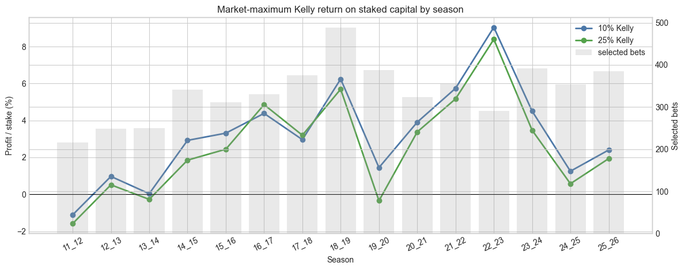

# Football Betting Market Efficiency

This repository presents a focused, reproducible quantitative study of football betting market efficiency. It tests whether historical odds contain systematic pricing patterns and whether price dispersion across quoted markets can create economically meaningful betting opportunities.

The central result is constructive: using an expanding-window out-of-sample design, the market-efficiency decision rule identifies a positive `market_maximum` opportunity set. The average quoted market price is difficult to exploit directly, but the best quoted prices recorded in the data produce positive historical results when selected through the rule.

The core idea is to estimate odds-implied probability ranges where historical forecast errors have been consistently positive. Bets are placed only when the lower 95% confidence bound of the fitted pricing-error curve remains above zero, and every test season uses parameters estimated from previous seasons only.

## Research question

Can systematic pricing patterns in football betting markets be identified, and can price dispersion turn those patterns into economically meaningful opportunities out of sample?

This is not framed as a search for naive bookmaker mistakes. Systematic pricing patterns may arise from bettor demand, favourite-longshot bias, and bookmaker margin allocation. The empirical question is whether these structural effects are persistent enough to define betting ranges with positive out-of-sample value.

## Main empirical result

The main notebook finds that `market_maximum` is the economically relevant result. In the saved run, the rule selects a meaningful number of market-maximum bets and produces positive flat-stake ROI. By contrast, `average_market` selects only one bet, so it is not economically meaningful. The result is generated out of sample: each test season uses parameters estimated only from previous seasons in an expanding-window design.

This is the key message of the project:

> Historical odds are highly informative, but price dispersion can still matter. The strongest economic signal appears in `market_maximum`, suggesting that best available quoted prices can be valuable when combined with a conservative statistical decision rule.

`market_maximum` represents the best quoted price recorded within the Football-Data coverage universe. It is the key series for studying whether price dispersion creates value. Football-Data states that these odds snapshots are collected before fixtures are played: Friday afternoons for weekend games and Tuesday afternoons for midweek games. The result is therefore not dismissed as artificial; it is a useful best-available-price opportunity set. The important execution caveat is that exact timestamped executability is not proven because synchronized quote timestamps, liquidity, and account constraints are not available in the dataset.

### Representative Kelly diagnostic

The main empirical result is the positive flat-stake ROI for the `market_maximum` opportunity set. Fractional Kelly staking is included as a sizing and path-risk diagnostic on the same selected bets; it does not change the bet-selection rule. The tested capped fractional-Kelly variants remain positive, supporting robustness to stake-sizing assumptions.



The plot shows return on staked capital by season for capped fractional-Kelly staking. It connects the statistical decision rule to bankroll-sensitive implementation and shows that the positive result is not tied to a single staking fraction. Kelly remains sensitive to probability-estimation error, so the figure is best interpreted as supportive economic evidence and a path-risk diagnostic.

## Methodology

The main notebook implements a market-efficiency decision rule inspired by Angelini and De Angelis (2019). The full equations and implementation details are shown in notebook Section 3; the core workflow is:

1. Convert quoted decimal odds into raw implied probabilities: $p_i = 1 / odds_i$.
2. Define forecast errors as realized outcomes minus implied probabilities: $\varepsilon_i = y_i - p_i$.
3. Estimate one pricing-error curve per source and league using historical data, with an intercept and a probability slope fitted from prior seasons.
4. For each test season, estimate parameters using previous seasons only in an expanding-window walk-forward design.
5. Derive accepted implied-probability ranges from the fitted prior-season curve, requiring the lower 95% confidence bound to be positive.
6. Apply the fitted rule out of sample by betting only when current odds fall inside those accepted ranges.
7. Evaluate selected bets using flat-stake ROI, fractional-Kelly staking, and bootstrap robustness diagnostics.

The main specification keeps the key research choices fixed: the top-division league universe, all available seasons, an expanding-window walk-forward design, and the paper-style 95% lower-confidence-bound decision rule. This reduces discretionary parameter search while keeping the test simple and transparent.

The public analysis focuses on two market sources:

- `average_market`: the average quoted market price;
- `market_maximum`: the best quoted market price in the Football-Data files.

This separation is important. `average_market` represents the broad market view, while `market_maximum` captures the best-price opportunity set available in the historical data.

## Data

The project uses historical football results and betting odds from [Football-Data.co.uk](https://www.football-data.co.uk/), including season-level European files and league-level files where relevant.

Football-Data states that betting odds for weekend fixtures are collected on Friday afternoons and midweek fixtures on Tuesday afternoons. Therefore, `market_maximum` is interpreted as the best quoted price available in the recorded pre-match snapshot. This supports its use as an opportunity-set proxy, while exact timestamped executability, liquidity, account limits, and capacity are not proven.

Raw source data are not redistributed in this repository. To reproduce the analysis, download the relevant Football-Data.co.uk files and place them under:

```text
data/raw/
```

For faster repeated execution, the repository includes a reproducible conversion pipeline that translates the raw season-level Excel files into one Parquet file per season:

```bash
python scripts/build_all_euro_season_parquets.py
```

The generated Parquet files stay local and are used only as a faster cache. They preserve the raw Football-Data fields as closely as possible and are not a separate data source.

Forward-monitoring parameter snapshots can be stored under [`docs/parameter_snapshots/`](docs/parameter_snapshots/). The intended convention is to publish frozen `market_maximum` parameters and accepted odds ranges using a stated training cutoff, before evaluating any future results generated with those parameters.

## Public notebooks

The public notebook sequence is intentionally minimal: one notebook contains the complete research presentation.

| Notebook | Role |
|---|---|
| `01_market_efficiency_decision_rule.ipynb` | Main research notebook. Implements the expanding-window market-efficiency decision rule, reports flat-stake results, fractional-Kelly staking, and bootstrap robustness. |


## Repository structure

```text
football-market-efficiency/
|-- .github/workflows/tests.yml
|-- data/
|   |-- raw/                    # user-provided Football-Data.co.uk files
|   |-- processed/              # generated local Parquet cache, not required in git
|   |-- README.md
|   `-- data_dictionary.md
|-- docs/
|   `-- assets/                 # figures embedded in documentation
|-- notebooks/
|   |-- 01_market_efficiency_decision_rule.ipynb
|   `-- README.md
|-- scripts/
|   `-- build_all_euro_season_parquets.py
|-- src/football_edge/
|   |-- data.py                 # data discovery, loading, and Football-Data column standardization
|   |-- market_efficiency.py    # main market-efficiency model, walk-forward rule, ROI/Kelly/bootstrap diagnostics
|   |-- plotting.py             # plotting helpers used by the public notebook
|   `-- config.py               # project paths and shared constants
|-- tests/
|-- pyproject.toml
`-- README.md
```

## How to run

Python 3.9 or later is recommended.

```bash
python -m venv .venv
```

Activate the environment, then install the project:

```bash
python -m pip install --upgrade pip
python -m pip install -e ".[dev]"
python -m pip install jupyter
```

Download the source Football-Data.co.uk files as described in [`data/README.md`](data/README.md), then optionally build the Parquet cache:

```bash
python scripts/build_all_euro_season_parquets.py
```

Run the tests:

```bash
python -m pytest
```

Run the public notebooks:

```bash
jupyter notebook notebooks/01_market_efficiency_decision_rule.ipynb
```

## Reproducibility

- Package version: `football-market-edge==0.1.0`.
- Supported Python version: Python 3.9 or later; the notebooks were prepared with Python 3.11.
- Randomness: bootstrap and Kelly robustness diagnostics use fixed random seeds configured in the notebooks.
- Deterministic components: data loading, feature construction, walk-forward splits, regression fitting, bet settlement, and deterministic summaries are reproducible for identical input files and dependency versions.
- Expected runtime: approximately 1-5 minutes for the main notebook after the Parquet cache has been built. Runtime depends on selected seasons/leagues, plotting backend, and bootstrap replications.

Exact reproduction requires the same Football-Data source files. Because provider files may be revised over time, a fully locked replication should record source URLs, download dates, and checksums.

## Limitations and points requiring caution

The project is intentionally explicit about limitations because they are central to credible quantitative research.

- `market_maximum` is the best quoted price recorded within the Football-Data coverage universe. It is directly relevant for studying price dispersion; exact timestamped executability is not proven for every match without synchronized quote timestamps, liquidity data, and limit information.
- Liquidity, stake limits, account restrictions, rejected bets, and commission are not fully modeled.
- Market/source coverage differs across seasons and leagues.
- COVID-era seasons may have different match and market dynamics.
- The analysis identifies historical pricing patterns; it does not establish why those patterns arise.
- Historical price dispersion may decay as markets become more efficient.
- Bootstrap diagnostics help assess robustness, but they cannot prove live tradability.

The project should be read as a market-efficiency and price-selection study, not as betting advice or a production trading system. The historical evidence is constructive, and live implementation would require timestamped quotes and explicit execution assumptions.

## Future work

High-value extensions would be:

- validate the rule prospectively on genuinely unseen matches;
- collect timestamped odds snapshots to verify simultaneous price availability;
- add explicit commission, liquidity, and stake-limit sensitivity.

## Reference

The main methodology is inspired by:

> Angelini, G., & De Angelis, L. (2019). Efficiency of online football betting markets. *International Journal of Forecasting*, 35(2), 712-721. https://doi.org/10.1016/j.ijforecast.2018.07.008

## License

Odds and match data come from [Football-Data.co.uk](https://www.football-data.co.uk/) and remain subject to the provider's terms. Source datasets are not redistributed in this repository.

Analysis code is available under the MIT License.
