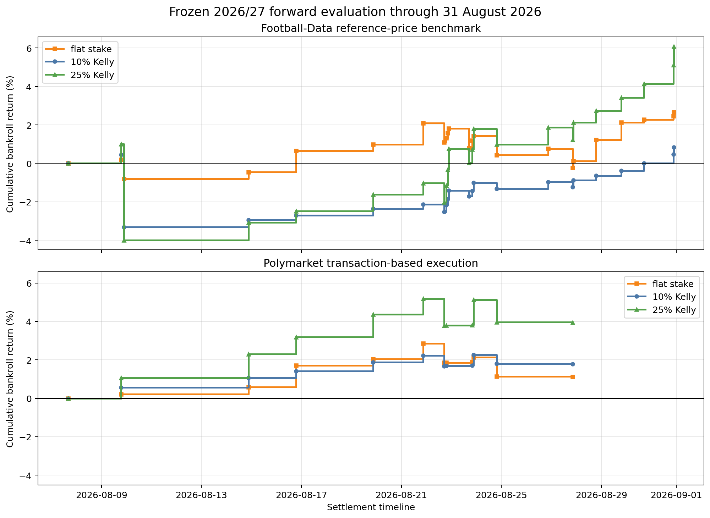
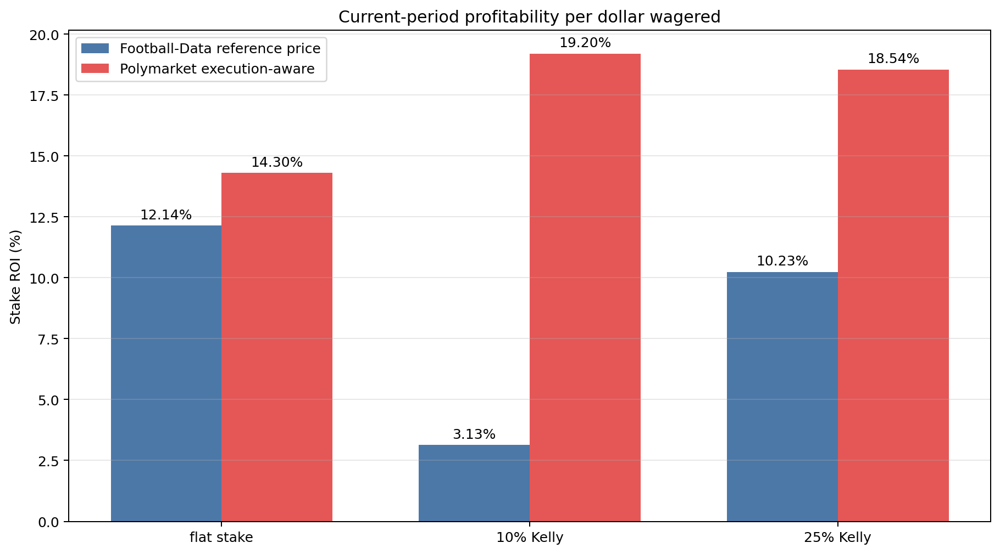

# 2026/27 forward holdout

> **Status:** frozen through 2025/26 · evaluated through **31 August 2026** · one completed month · no parameter re-estimation

The market-efficiency decision rule and league-specific acceptance ranges were frozen using data only through the 2025/26 season. The 2026/27 season is now being evaluated prospectively to test whether the signal remains economically positive out of sample and whether selected opportunities survive explicit execution constraints.

Two complementary evaluations separate the research question cleanly:

- [Notebook 02](../../notebooks/02_forward_market_maximum_benchmark.ipynb) is the **Football-Data reference-price benchmark**. It assumes full placement at `MaxH` and measures signal performance at the reference price.
- [Notebook 04](../../notebooks/04_forward_polymarket_execution.ipynb) is the **Polymarket transaction-based execution evaluation**. It applies the same frozen signal under eligible transaction prices, modeled buyer fees, traded-flow participation, partial fills, chronological settlement, and cash constraints.

In short, **02 measures reference-price signal performance; 04 evaluates execution-aware performance**.

## Current forward results

The early forward results are encouraging. All three staking specifications are profitable at the Football-Data reference price, while a smaller executable subset also remains profitable under the stricter Polymarket transaction-based evaluation.

| Evaluation | Strategy | Qualifying signals | Bets evaluated / executed | Wins | Hit rate | Cumulative bankroll return | Stake ROI | Max drawdown | Annualized weekly Sharpe |
|---|---|---:|---:|---:|---:|---:|---:|---:|---:|
| Football-Data reference price | flat stake | 22 | 22 evaluated | 17 | 77.27% | 2.67% | 12.14% | 2.28% | 3.40 |
| Football-Data reference price | 10% Kelly | 22 | 22 evaluated | 17 | 77.27% | 0.84% | 3.13% | 3.76% | 0.68 |
| Football-Data reference price | 25% Kelly | 22 | 22 evaluated | 17 | 77.27% | 6.08% | 10.23% | 4.95% | 2.81 |
| Polymarket transaction-based | flat stake | 22 | 11 executed | 8 | 72.73% | 1.12% | 14.30% | 1.69% | 2.34 |
| Polymarket transaction-based | 10% Kelly | 22 | 11 executed | 8 | 72.73% | 1.78% | 19.20% | 0.53% | 8.86 |
| Polymarket transaction-based | 25% Kelly | 22 | 11 executed | 8 | 72.73% | 3.94% | 18.54% | 1.33% | 8.02 |

Notebook 02 evaluates all 22 qualifying Football-Data signals at `MaxH`. Notebook 04 executes 11 bets because each signal must additionally have an eligible Polymarket transaction price and satisfy the frozen execution, participation, cash, and partial-fill rules. The two evaluations therefore do not represent identical executed samples.

Annualized Sharpe ratios currently use only four Tuesday–Monday weekly observations and should be read as descriptive diagnostics, not mature risk estimates.

## Cumulative bankroll return

The panels are deliberately separated because the reference-price benchmark and transaction-based evaluation use different opportunity sets and execution assumptions.

## Stake ROI

Stake ROI measures profit per dollar actually wagered:

$$
\text{Stake ROI}=100\times\frac{\sum_i \text{profit}_i}{\sum_i \text{stake}_i}.
$$

Bankroll return measures portfolio capital growth; Stake ROI measures profitability per dollar wagered. They are complementary and should not be interpreted interchangeably. Because only one completed month is available, the current report uses a grouped full-period comparison rather than an artificial one-point monthly series.

## Benchmark versus execution

| | 02: Football-Data benchmark | 04: Polymarket execution |
|---|---|---|
| Signal | Frozen Football-Data rule | Same frozen rule |
| Price | Football-Data `MaxH` | Eligible Polymarket execution price |
| Fees | No separate fee; bookmaker margin is embedded in `MaxH` | Modeled buyer fee |
| Full placement | Assumed | No |
| Liquidity | Not modeled | Historical traded-flow proxy |
| Partial fills | No | Yes |
| Purpose | Reference-price signal benchmark | Execution-aware evaluation |

## Interpretation

The current evidence is a positive first forward indication: the frozen signal remains profitable at its Football-Data reference price, and a subset of opportunities survives the more restrictive Polymarket transaction-based framework.

The sample is still small. Sharpe, volatility, drawdown, and league-level comparisons are descriptive rather than mature estimates. `MaxH` is a reference-price benchmark, not proof that the price was historically executable at a specific timestamp or size. Polymarket historical traded flow is a practical execution and liquidity proxy, not proof of a hypothetical fill or future live capacity. These results do not establish future profitability.

## Research workflow

1. [Historical research and decision rule](../../notebooks/01_market_efficiency_decision_rule.ipynb) — estimate the model in expanding-window tests and motivate the frozen rule.
2. [Forward reference-price benchmark](../../notebooks/02_forward_market_maximum_benchmark.ipynb) — evaluate all qualifying completed matches at Football-Data `MaxH`.
3. [Forward Polymarket data collection](../../notebooks/03_forward_polymarket_data_collection.ipynb) — collect auditable monthly transaction observations for the same frozen signals.
4. [Execution-aware forward evaluation](../../notebooks/04_forward_polymarket_execution.ipynb) — apply transaction price, fee, participation, partial-fill, chronology, and cash constraints.

The frozen parameter snapshot is published in [`docs/parameter_snapshots`](../../docs/parameter_snapshots/README.md).

## Status and updates

The current evaluation cutoff is **31 August 2026**, inclusive. The 2026/27 forward sample will accumulate as completed months are added, while the frozen signal parameters and acceptance ranges remain unchanged. Report figures can be refreshed with [`build_figures.py`](build_figures.py) after notebooks 02 and 04 have been updated from the same finalized inputs.
