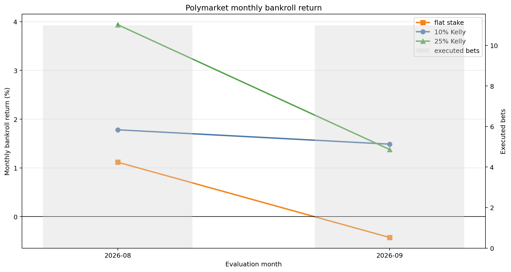
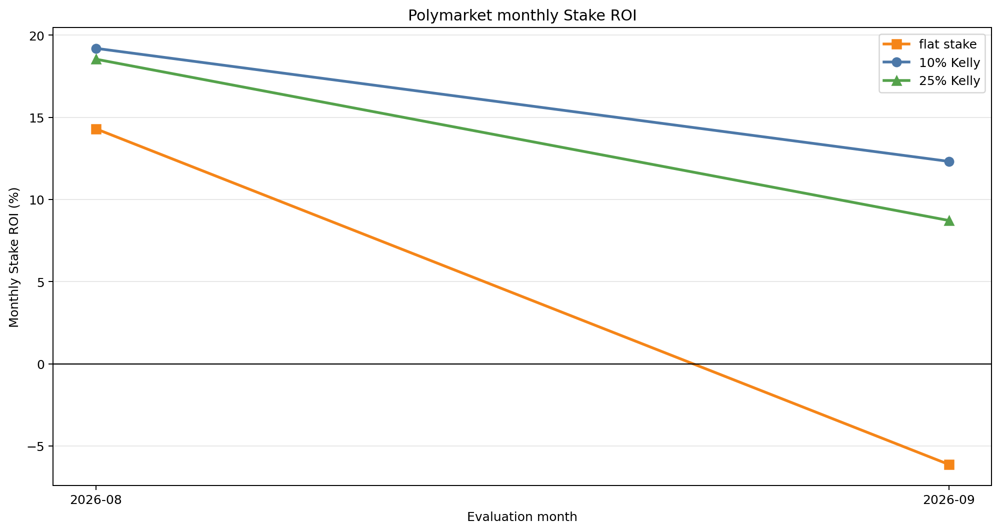

# 2026/27 forward holdout

> **Status:** frozen through 2025/26 · evaluated from 9 August through **20 September 2026** · two forward evaluation windows · no parameter re-estimation

The market-efficiency decision rule and league-specific acceptance ranges were frozen using data only through the 2025/26 season. The 2026/27 season is now being evaluated prospectively to test whether selected opportunities remain economically positive after explicit execution constraints.

The primary economic evaluation is the [Polymarket transaction-based execution notebook](../../notebooks/04_forward_polymarket_execution.ipynb). Football-Data and the frozen parameters determine which matches qualify and the estimated home-win probability; Polymarket supplies only the execution evidence. The evaluation then applies eligible transaction prices, buyer-side costs, historical traded-flow participation, partial fills, chronological settlement, and cash constraints.

## Current Polymarket results

The early transaction-based results are encouraging. Both fractional-Kelly specifications were profitable in August and September, while flat staking remains cumulatively positive after a modest negative September.

The current sample contains **22 executed bets**, **15 wins**, and a **68.18% hit rate**. The executed-bet sample is identical across the three staking specifications; only capital allocation differs.

| Strategy | Cumulative bankroll return | Stake ROI | Max drawdown | Annualized weekly volatility | Annualized weekly Sharpe |
|---|---:|---:|---:|---:|---:|
| flat stake | 0.68% | 4.59% | 3.16% | 7.94% | 0.67 |
| 10% Kelly | 3.29% | 15.28% | 0.53% | 3.68% | 6.58 |
| 25% Kelly | 5.37% | 14.26% | 1.78% | 7.89% | 4.98 |

Weekly risk statistics currently use only seven Tuesday–Monday observations and should be read as descriptive diagnostics, not mature estimates.

## Monthly performance

### Bankroll return

Monthly bankroll return measures the percentage change in portfolio capital during each evaluation month. The grey bars show the number of executed bets; all three strategies currently share the same executed-bet sample.

### Stake ROI

Monthly Stake ROI measures profit per dollar actually wagered during the month:

$$
\text{Stake ROI}_m=100\times\frac{\sum_{i\in m}\text{profit}_i}{\sum_{i\in m}\text{filled stake}_i}.
$$

Bankroll return measures portfolio capital growth; Stake ROI measures profitability per dollar actually wagered. They are complementary and should not be interpreted interchangeably.

Only two monthly observations are currently available, so the connecting lines should not be interpreted as an established trend. They nevertheless provide a useful first forward record: both Kelly specifications remained profitable in each observed month, and all three strategies remain profitable over the combined period. Exact calculations and cumulative bankroll paths are available in [notebook 04](../../notebooks/04_forward_polymarket_execution.ipynb).

## Reference-price context

The [Football-Data reference-price benchmark](../../notebooks/02_forward_market_maximum_benchmark.ipynb) remains a useful signal diagnostic. It evaluates every qualifying completed match at `MaxH`, assumes full placement, and does not model venue availability, liquidity, or partial fills.

| Evaluation window | flat stake | 10% Kelly | 25% Kelly |
|---|---:|---:|---:|
| August 2026 | 2.67% | 0.84% | 6.08% |
| September 2026 | -6.05% | -3.37% | -9.91% |

These figures are monthly bankroll returns. The negative September reference-price results are retained for transparency. The Polymarket evaluation uses a smaller, execution-eligible transaction sample, so divergence between the two analyses is informative but is not evidence that either venue dominates on a directly comparable set of bets.

## Interpretation

The current evidence is a positive early forward indication for the transaction-based implementation. Without re-estimating the signal, both Kelly specifications remained profitable in each reported evaluation window under the modeled execution constraints.

The sample is still small. Sharpe, volatility, drawdown, and league-level comparisons are descriptive rather than mature estimates. Polymarket historical traded flow is a practical execution and liquidity proxy, not proof of a hypothetical fill or future live capacity. These results do not establish future profitability.

## Research workflow

1. [Historical research and decision rule](../../notebooks/01_market_efficiency_decision_rule.ipynb) — estimate the model in expanding-window tests and motivate the frozen rule.
2. [Forward reference-price benchmark](../../notebooks/02_forward_market_maximum_benchmark.ipynb) — evaluate all qualifying completed matches at Football-Data `MaxH`.
3. [Forward Polymarket data collection](../../notebooks/03_forward_polymarket_data_collection.ipynb) — collect auditable monthly transaction observations for the same frozen signals.
4. [Execution-aware forward evaluation](../../notebooks/04_forward_polymarket_execution.ipynb) — apply transaction price, fee, participation, partial-fill, chronology, and cash constraints.

The frozen parameter snapshot is published in [`docs/parameter_snapshots`](../../docs/parameter_snapshots/README.md).

## Status and updates

The current transaction-based evaluation cutoff is **20 September 2026**, inclusive. The 2026/27 forward sample will accumulate as additional completed evaluation windows are added, while the signal parameters, acceptance ranges, and execution protocol remain frozen. The report figures can be refreshed with [`build_figures.py`](build_figures.py) after the finalized transaction files are updated.
